<!--   pdf_document: default
 md_document -->

---
output:
  md_document: default
  pdf_document: default
  word_document: default
  html_document: default
---

```{r, include=FALSE,eval=FALSE}
options(tinytex.verbose = TRUE)
options(dplyr.summarise.inform = FALSE)
```

```{r setup, include=FALSE,eval=FALSE}
library(magrittr)
library(dplyr)
library(tidyverse) 
library(sjmisc)
library(ggplot2)
library(reshape2)
library(gapminder)
library(mosaic)
library(extraDistr)
library(caret)
library(modelr)
library(parallel)
library(foreach)
library(rsample)
library(lubridate)
library(olsrr)
library(rpart)
library(rpart.plot)
library(randomForest)
library(gbm)
library(gamlr)
library(knitr)
library(modelsummary)
library (ClusterR)  # for kmeans++
library(devtools)
library(ggfortify)
library(igraph)
library(arules)  # has a big ecosystem of packages built around it
library(arulesViz)
```

# 1) Clustering and PCA

## 1-1 Procedures

1. Distinguishing White and Red

we used the method of PCA(rank=2) and the Clustering(K-means(K=2), Hierarchical clustering with "single", "complete" and "average")


2. Distinguishing Quality

we used the method of PCA(rank=2) and the Clustering(K-means(K=7)). Note that the reason of not using hierarchical clustering is that this way does not show

## 1-2 Result (White and Red)

```{r, echo=FALSE, message=FALSE, warning=FALSE, results='hide',eval=FALSE}
wine <- read.csv("wine.csv")

## PCA
pca_result <- prcomp(wine[-13], scale. = TRUE)
wine_types <- as.factor(wine$color)
levels(wine_types) <- c("Red", "White")

# Prepare the PCA data for ggplot2
pca_data <- as.data.frame(pca_result$x[, 1:2])
colnames(pca_data) <- c("PC1", "PC2")
pca_data$wine_type <- wine_types

# Visualize PCA results
ggplot(pca_data, aes(x = PC1, y = PC2, color = wine_type)) +
  geom_point(alpha = 0.7) +
  theme_bw() +
  labs(title = "PCA Plot of Wine Data", x = "PC1", y = "PC2") +
  theme(legend.title = element_text(size = 12), legend.text = element_text(size = 10))
ggsave("./fig/1pca.png")

## Clustering
# K-means
# we wanna to identify them into two clusters and so use K-means at 2.
X = wine[-13]
X = scale(X, center=TRUE, scale=TRUE)

wine_kmean = kmeans(X, 2, nstart=25)

# Red and White (Actual data)
ggplot(wine) + 
  geom_point(aes(pH,fixed.acidity, color=factor(color)))
ggsave("./fig/1act1.png")

# Good identification
ggplot(wine) + 
  geom_point(aes(pH,fixed.acidity, color=factor(wine_kmean$cluster)))+
    labs(title="Plot of k-means(good identification)") +
   scale_color_manual(values=c("#00BFC4","#F8766D"))
ggsave("./fig/1km1.png")


## Hierarchical clustering
wine_distance_matrix = dist(X, method='euclidean')

hier_wine = hclust(wine_distance_matrix, method='single')
hier_clust_sing = cutree(hier_wine, k=2)
hier_wine = hclust(wine_distance_matrix, method='complete')
hier_clust_comp = cutree(hier_wine, k=2)
hier_wine = hclust(wine_distance_matrix, method='average')
hier_clust_avg = cutree(hier_wine, k=2)

# H-clustering -> bad
ggplot(wine) + 
  geom_point(aes(pH,fixed.acidity, color=factor(hier_clust_sing)))+
    labs(title="Plot of HC(single)",
        x ="pH", y = "fixed.acidity")
ggsave("./fig/1sing.png")
ggplot(wine) + 
  geom_point(aes(pH,fixed.acidity, color=factor(hier_clust_comp)))+
    labs(title="Plot of HC(average)",
        x ="pH", y = "fixed.acidity")
ggsave("./fig/1comp.png")
ggplot(wine) + 
  geom_point(aes(pH,fixed.acidity, color=factor(hier_clust_avg)))+
    labs(title="Plot of HC(complete)",
        x ="pH", y = "fixed.acidity")
ggsave("./fig/1avg.png")
```

### PCA

First, we shows the result of the PCA method, which looks like it can be good identification. 

```{r, echo=FALSE,out.width ="50%", out.height = "50%",fig.align='center',fig.show="hold"}
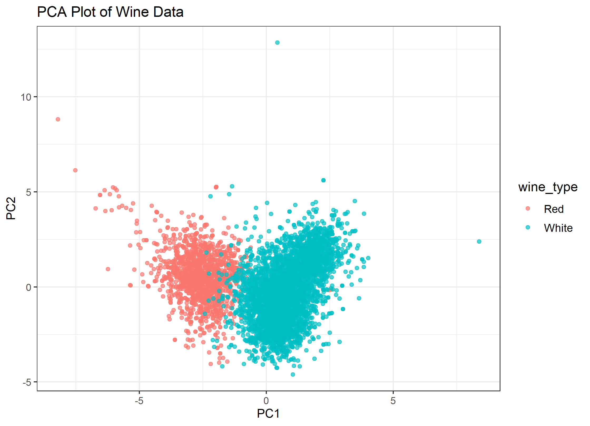
```

Also, at another approach, 

```{r, echo=FALSE, message=FALSE, warning=FALSE, results='hide',eval=FALSE}
X = wine[,-(12:13)]
X = scale(X, center=TRUE, scale=TRUE)
mu = attr(X,"scaled:center")
sigma = attr(X,"scaled:scale")

wine.pca1 = prcomp(X, rank = 6)
summary(wine.pca1)
str(wine.pca1)
```

```
[Result]
Importance of first k=6 (out of 11) components:
                          PC1    PC2    PC3     PC4     PC5     PC6
Standard deviation     1.7407 1.5792 1.2475 0.98517 0.84845 0.77930
Proportion of Variance 0.2754 0.2267 0.1415 0.08823 0.06544 0.05521
Cumulative Proportion  0.2754 0.5021 0.6436 0.73187 0.79732 0.85253
```
**From the results, we can notice that PC2 explains 50% of the variations, and PC6 explains 85% as cumulative.**


Let's first work on PCA1 and PCA2.


```{r, echo=FALSE, message=FALSE, warning=FALSE, results='hide',eval=FALSE}
loadings = wine.pca1$rotation
scores = wine.pca1$x
wine2 = cbind(wine, wine.pca1$x[,1:6]) 
```


```{r, echo=FALSE, message=FALSE, warning=FALSE, results='hide',eval=FALSE}
ggplot(wine2, aes(PC1, PC2, col=quality)) + 
  geom_point(shape = "circle", size = 1.5) +
 scale_color_viridis_c(option = "magma", direction = 1) +
 theme_minimal()
ggsave("./fig/1pca2.png")

ggplot(wine2, aes(PC1, PC2, col=color, fill=color)) + 
  stat_ellipse(geom= "polygon", col="black", alpha=0.5) +
  geom_point(shape = 21, col = "black")+
   theme_minimal()
ggsave("./fig/1pca3.png")
#larger alcohol and smaller density is correlated with quality
```

```{r, echo=FALSE,out.width ="70%", out.height = "70%",fig.align='center',fig.show="hold"}
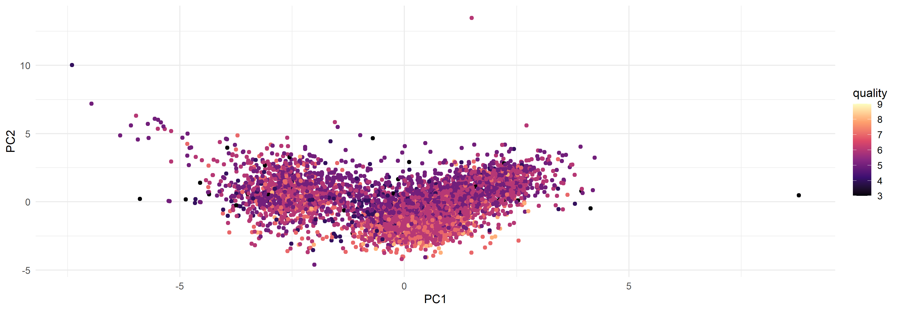
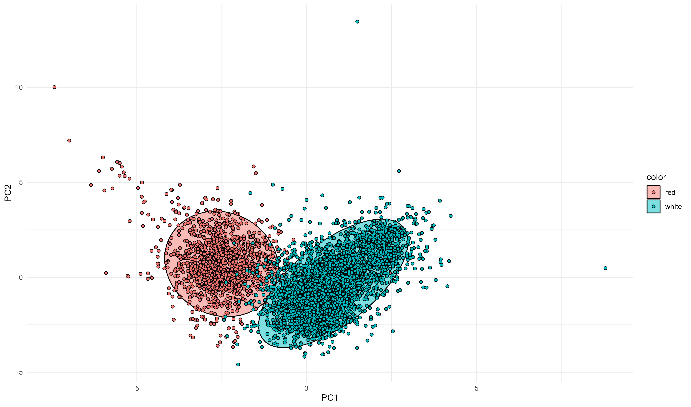
```

PCA1 and PCA2 were able to distinguish between red wines and white wines. There are some blue points lay in the red circle, that's because their chemical properties must be very close to each others. However, in general the algorithm succeed in differentiating the colors. In terms of quality, it seems the higher quality wines are the points below 0 for PCA2 and above 0 for PCA1 in general. However, let's understand how PCA1 and 2 are formed.


```{r, echo=FALSE, message=FALSE, warning=FALSE, results='hide',eval=FALSE}
autoplot(wine.pca1, data = wine, colour = 'color', alpha = .9,
loadings = TRUE, loading.color = "red",
loadings.label = TRUE, loadings.label.size = 3)
autoplot(wine.pca1, data = wine, colour = 'quality', alpha = .9,
loadings = TRUE, loading.color = "red",
loadings.label = TRUE, loadings.label.size = 3)
```


```{r, echo=FALSE,out.width ="70%", out.height = "70%",fig.align='center',fig.show="hold"}
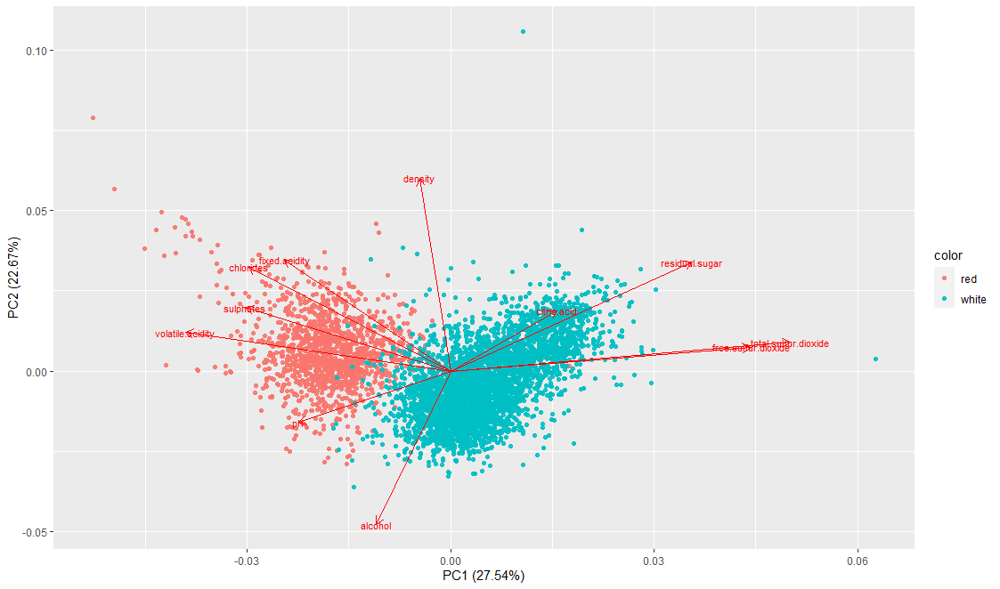
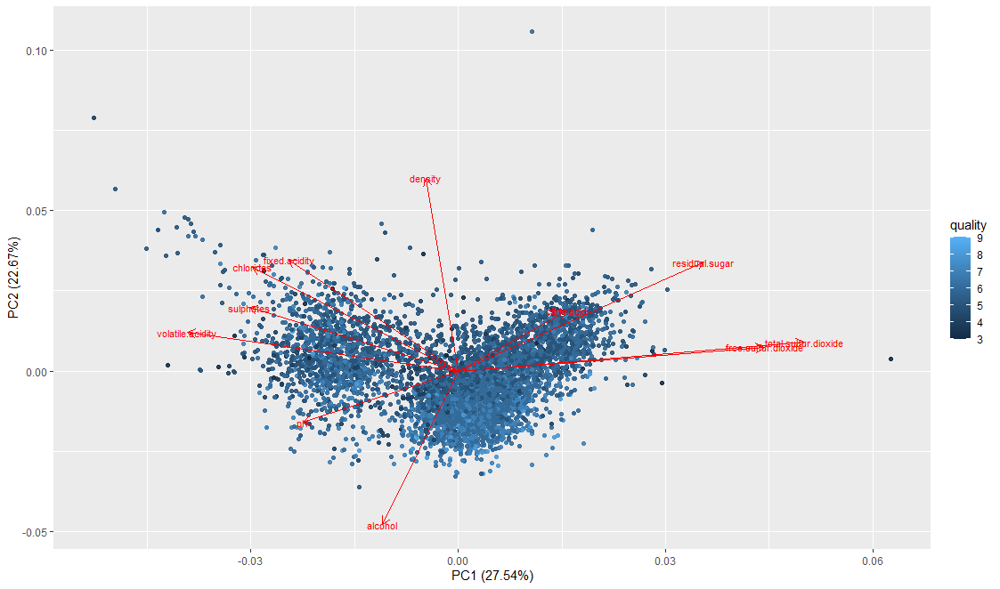
```

From the graph above we can know that quality is negatively correlated with density, fixed acidity, chlorides. On the other hand, it is positively correlated with alcohol. 

### K-means

Second, we shows the result of the K-means method (K=2). This is the graph of the actual data.
```{r, echo=FALSE,out.width ="50%", out.height = "50%",fig.align='center',fig.show="hold"}
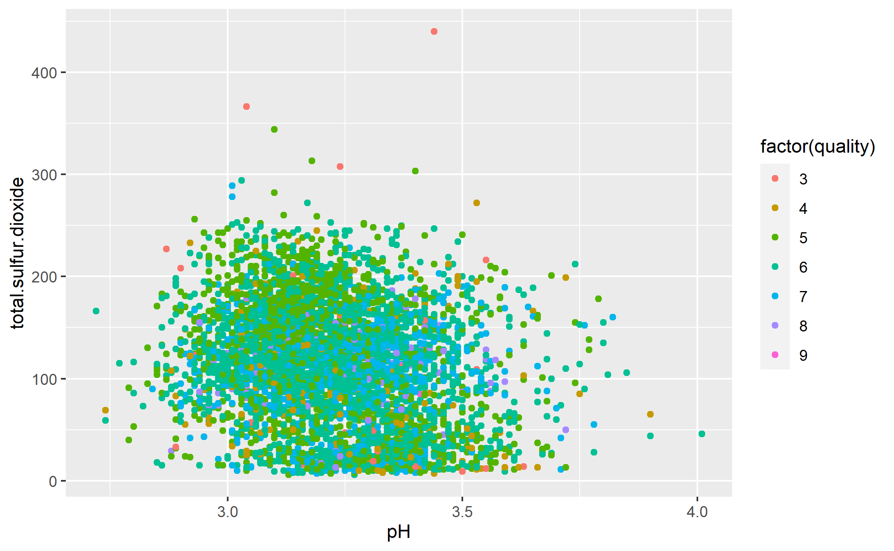
```

And, this is the k-means graph that looks like being able to be the same as the actual data. So, we can think this method can distinguish data into two parts(x-axis=pH, y-axis=fixed.acidity) because these factors are different between white and red wines.

```{r, echo=FALSE,out.width ="50%", out.height = "50%",fig.align='center',fig.show="hold"}
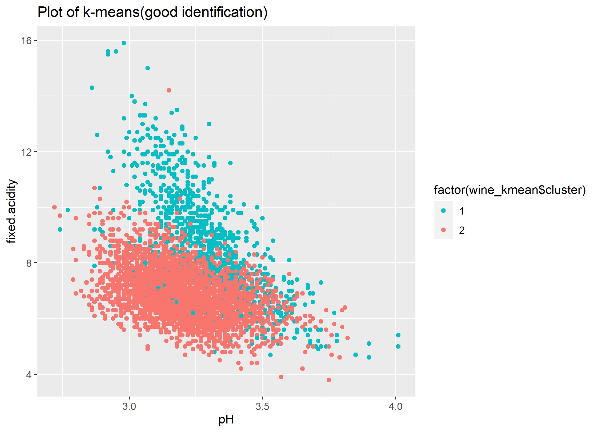
```

### Hierarchical clustering

Third, we used Hierarchical clustering with the minimum linkage of "single", "complete" and "average". However, all of them looks like bad identification. Probably because Hierarchical clustering identify data into two parts step by step and so in the case of white and red wine(they looks like almost same characteristics) this method doesn't work well with only unsupervised technique.

```{r, echo=FALSE,out.width ="50%", out.height = "50%",fig.align='center',fig.show="hold"}
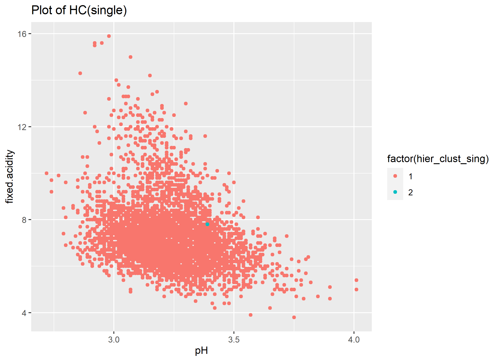
knitr::include_graphics("./fig/1comp.png")
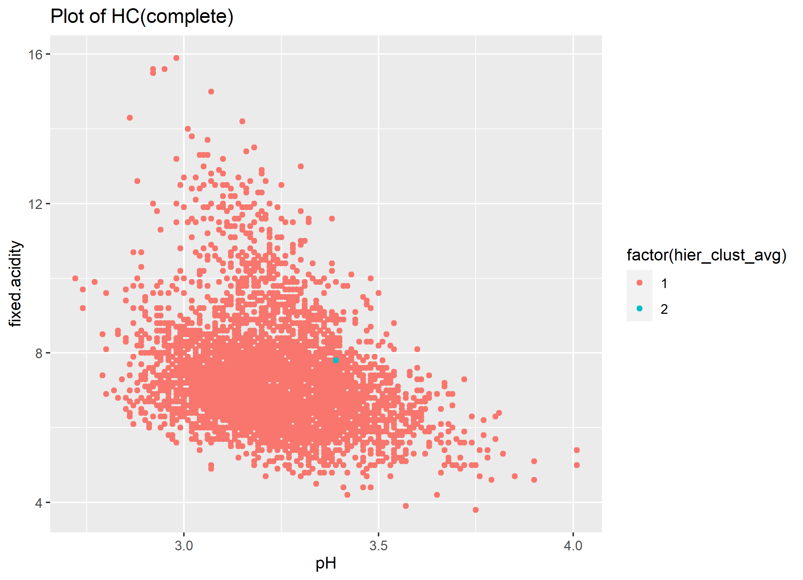
```

## 1-3 Result (Quality)

```{r, echo=FALSE, message=FALSE, warning=FALSE, results='hide',eval=FALSE}
## PCA
wine2 <- wine %>% mutate(color = case_when(
                color == "red" ~ 1,
                color == "white" ~ 2
))

pca_result <- prcomp(wine2[-12], scale. = TRUE)
wine_types <- as.factor(wine$quality)
levels(wine_types) <- c("3", "4","5","6","7","8","9")

# Prepare the PCA data for ggplot2
pca_data <- as.data.frame(pca_result$x[, 1:2])
colnames(pca_data) <- c("PC1", "PC2")
pca_data$wine_type <- wine_types

# Visualize PCA results
ggplot(pca_data, aes(x = PC1, y = PC2, color = wine_type)) +
  geom_point(alpha = 0.7) +
  theme_bw() +
  labs(title = "PCA Plot of Wine Data", x = "PC1", y = "PC2") +
  theme(legend.title = element_text(size = 12), legend.text = element_text(size = 10))
ggsave("./fig/1pca2.png")

## Clustering Bad
# K-means
# we wanna to identify them into two clusters and so use K-means at 2.
X = wine2[-12]
X = scale(X, center=TRUE, scale=TRUE)
wine_kmean = kmeans(X, 7, nstart=25)

# Quality (Actual data) Bad
ggplot(wine2) + 
  geom_point(aes(pH,total.sulfur.dioxide, color=factor(quality)))
ggsave("./fig/1act2.png")

# Bad
ggplot(wine2) + 
  geom_point(aes(pH,total.sulfur.dioxide, color=factor(wine_kmean$cluster)))+
    labs(title="Plot of k-means")
ggsave("./fig/1km2.png")
```


### PCA

We cannot distinguish the quality of the wine in PCA.

```{r, echo=FALSE,out.width ="50%", out.height = "50%",fig.align='center',fig.show="hold"}

```

### Clustering

At the actual data, We cannot distinguish the quality of the wine well.

```{r, echo=FALSE,out.width ="50%", out.height = "50%",fig.align='center',fig.show="hold"}

```

Therefore, we cannot judge that this clustering did work well.

```{r, echo=FALSE,out.width ="50%", out.height = "50%",fig.align='center',fig.show="hold"}
knitr::include_graphics("./fig/1km2.png")
```

## 1-4 Conclusion (Answers)

In conclusion, the best technique that makes sense to me was **"PCA"** in our analysis because it can identify data into two parts automatically. The second one is "K-mean" because if we set adequate x-axis and y-axis, we can identify data well.

However, we cannot distinguish the quality of the wine well as we showed above, probably because we need more the number of data on wine or these characteristics on wine in data does not relate to the quality.

\newpage

# 2) Market segmentation

## 2-1 Overview

To understand market segments, we got two 

1. Eight groups from categorized items in the data

2. Estimated which groups we should put "uncategorized" tweets into

Also, from these results, we suggested two points for "NutrientH20" in the conclusion.


## 2-2 Data and cleaning

At first, We used social_marketing.csv as a data, and did data cleaning as follow:

1. in actual data, we crate a dummy variable that is spam or not.<br>
2. with logit model(dependent variable: spam dummy, independent variable: following variables), estimates the probability of spam by each individuals. <br>

$$
\begin{aligned}
spam&=\beta_0+\beta [ adult\times(all\ variables)+uncategorized\times(all\ variables) \\&+dating\times(all\ variables)+news\times(all\ variables)+current_events\times(all\ variables)]+\varepsilon
\end{aligned}
$$

3. if the probability of spam is over 0.5(50%), the person are judge as a spam.<br>
4. Remove actual spam, adult and estimated spam from raw dataset. So the number of observation in new dataset will decrease from 7882 to 7306.<br>

```{r, echo=FALSE, message=FALSE, warning=FALSE, results='hide',eval=FALSE}
social_marketing <- read.csv("social_marketing.csv")

## Logit
data <- social_marketing[-1]
data <- data %>% mutate(spam = ifelse(spam>=1,1,0))
logit_spam = glm(spam ~adult:.+uncategorized:.+dating:.+news:.+current_events:., data=data, family='binomial')

phat_test_logit_spam = predict(logit_spam, data, type='response')
yhat_test_logit_spam = ifelse(phat_test_logit_spam > 0.5, 1, 0)
confusion_out_logit = table(y = data$spam,
yhat = yhat_test_logit_spam)
accuracy_out=1- (confusion_out_logit[2,1]+confusion_out_logit[1,2])/sum(confusion_out_logit)
TPR_logit =  (confusion_out_logit[2,2])/(confusion_out_logit[2,1]+confusion_out_logit[2,2])
FPR_logit = (confusion_out_logit[1,2])/(confusion_out_logit[1,1]+confusion_out_logit[1,2])
FDR_logit =  (confusion_out_logit[1,2])/(confusion_out_logit[1,2]+confusion_out_logit[2,2])

# besides of actual spam and adult, predict spam should be removed from the dataset
ndata <- as.data.frame(cbind(social_marketing,yhat_test_logit_spam))
ndata <- ndata %>% mutate(spam = ifelse(yhat_test_logit_spam==1 | spam==1,1,0))
ndata <- ndata[-38]
ndata <- ndata %>% filter(spam==0) %>% filter (adult==0)
```


Note that the indicies of the result of the logit model is as follow:
```{r, echo=FALSE,out.width ="50%", out.height = "70%",fig.align='center'}
table <- matrix(c(0.994, 0.55, 0.0003, 0.1), nrow = 1, ncol = 4, byrow = TRUE)
colnames(table) <- c("accuracy", "TPR","FPR","FDR")
knitr::kable(table,caption = "the output of LPM and Logit")
```

From the result, although TPR is 55%(that is the maximum value that I found), other variables shows good result.

## 2-3 Model and Results

### How can we make more some groups to understnad market segements?

The data we got had so many categorised, and so it was hard to understand the market and the trend of consumers' preference. So we tried to make more small groups from these data.

#### Correlation

First, we saw correlation between categorised items, and we got the result in the following.

```{r, echo=FALSE, message=FALSE, warning=FALSE, results='hide',eval=FALSE}
# First normalize phrase counts to phrase frequencies.
Z = ndata[-1]/rowSums(ndata[-1])
Z =Z[-c(5,35,36)]
ggcorrplot::ggcorrplot(cor(Z), hc.order = TRUE)
```


```{r, echo=FALSE,out.width ="80%", out.height = "80%",fig.align='center',fig.show="hold"}
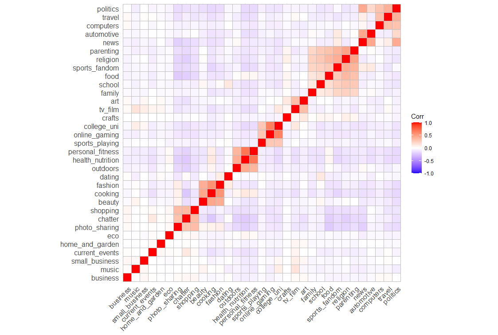
```

#### PCA and Correlation

Second, we thought there were eight groups from the above result, and also did PCA with rank 8 and saw the correlation between PCs and categoriesed item as follow:

```{r, echo=FALSE, message=FALSE, warning=FALSE, results='hide',eval=FALSE}
pca2 = prcomp(Z, scale=TRUE, rank=8)
pca2_data <- as.data.frame(cbind(pca2$x[, 1:8],Z))

cor_PC <- as.data.frame(cor(pca2_data))
cor_PC <- cor_PC[-c(1:8),-c(9:42)]
heatmap(as.matrix(cor_PC))
```

```{r, echo=FALSE,out.width ="80%", out.height = "80%",fig.align='center',fig.show="hold"}
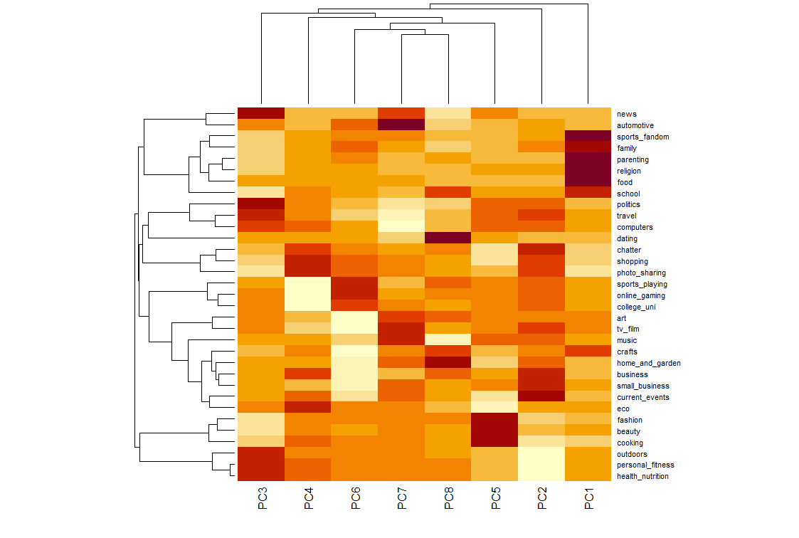
```

##### Eight groups

From these above graphs, we can identify eight groups on market segments as follow:

  1. (PC1) chatter, shopping, photo_sharing <br>
  2. (PC2) health nutrition, personal fitness, outdoors<br>
  3. (PC3) fashion, cooking, beauty <br>
  4. (PC4) college univ, online gaming, sports playing<br>
  5. (PC5) eco, home and garden, crafts<br>
  6. (PC6) current_events, small_business, business, news
  7. (PC7) computers, travel, politics, dating
  8. (PC8) music, tv_film, news

  
We also did robustness check with K-means method in Appendix 2-5-1.

### Which kind of groups is close to "Uncategorized" tweet?

Also, we have identified which kind of groups "uncategorized" tweets are close to.  So we used the linear probability model(see detail in Appendix). The coefficients that I got from the estimation is as follow:

```{r, echo=FALSE, message=FALSE, warning=FALSE, results='hide',eval=FALSE}
Z = ndata[-1]/rowSums(ndata[-1])
Z =Z[-c(35,36)]
Z <- as.data.frame(cbind(pca2$x[, 1:8],Z))

lpm = lm(uncategorized ~ PC1 + PC2 + PC3 + PC4 + PC5+PC6+PC7+PC8,data = Z)
summary(lpm)
```

```{r, echo=FALSE}
knitr::kable(c(PC1="0.0015361***", PC2="-0.0008606***", PC3="0.0005582*", PC4="0.0004989*", PC5="0.0003274", PC6="0.00277598***", PC7="-0.0006407*", PC8="-0.0007794*", Intercept="0.02301***"))
```

From the result, PC1 and PC6 are the positive coefficients and high coefficient values, and out of them the coefficient of the PC6 is highest. So we can think **the uncategorized tweet might be related to "current_events", "business", "small_business", and "news"**

## 2-4 Conclusion

### Summarized our results

To understand market segmentation easier, we suggested eight groups from diverse categorized items. That is (1)chatter, shopping, photo_sharing. (2)health nutrition, personal fitness, outdoors. (3) fashion, cooking, beauty, (4)college univ, online gaming, sports playing, (5)eco, home and garden, crafts, (6)current_events, small_business, business, news, (7) computers, travel, politics, dating, and (8) music, tv_film, news.

Also, we combined the result of these groups and the linear probability model and estimated which kind of groups were close to "uncategorized". From the result, we could think "uncategorized" tweets might be related to "current_events", "business", "small_business", and "news".

### Suggestion for "NutrientH20"

For "NutrientH20", we suggested some points from these result. The first one is "NutrientH20" should set one targets from eight groups to sell drinks. As we showed, eight groups are related to one each other. Also, it is not realistic to target all categorized consumer but they can do to one of eight groups. So please refer to eight groups that we identified when making a strategy on market targeting.

Second, if "NutrientH20" find "uncategorized" tweets, they should think that the probability that they are in (1) and (6) out of eight groups is high. And, specifically, (6) is mostly plausible. This is helpful if they make a plan of market research in real, such as save their time to being confusing which kind of groups they should put uncategorized tweets into.

## 2-5 Appendix

### 2-5-1: Robustness check (K-means Clustering)

Also, to do robustness check, we did K-means clusterinig.

```{r, echo=FALSE, message=FALSE, warning=FALSE, results='hide',eval=FALSE}
Z = ndata[-1]/rowSums(ndata[-1])
Z =Z[-c(5,35,36)]
km = kmeans(Z, 8, nstart=50)

ggplot(Z)+ 
  geom_point(aes(politics, beauty, color=factor(km$cluster)))+labs(title="politics-bueauty looks independent")
ggsave("./fig/2km1.png")
ggplot(Z)+ 
  geom_point(aes(politics, travel, color=factor(km$cluster)))+labs(title="politics-travel looks related")
ggsave("./fig/2km2.png")
ggplot(Z)+ 
  geom_point(aes(shopping, photo_sharing, color=factor(km$cluster)))+labs(title="shopping-photo_sharing looks related")
ggsave("./fig/2km3.png")
ggplot(Z)+ 
  geom_point(aes(shopping, online_gaming, color=factor(km$cluster)))+labs(title="shopping-online_gaming looks independent")
ggsave("./fig/2km4.png")
```

```{r, echo=FALSE,out.width ="50%", out.height = "50%",fig.align='center',fig.show="hold"}
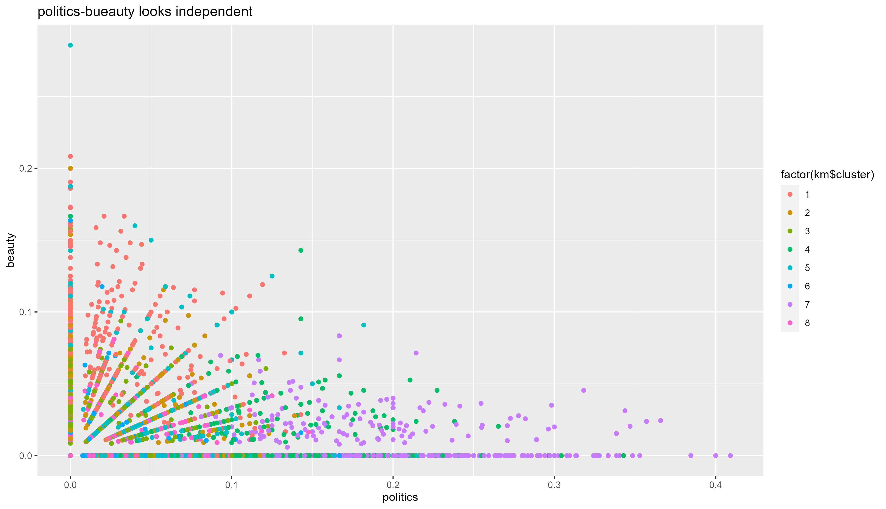
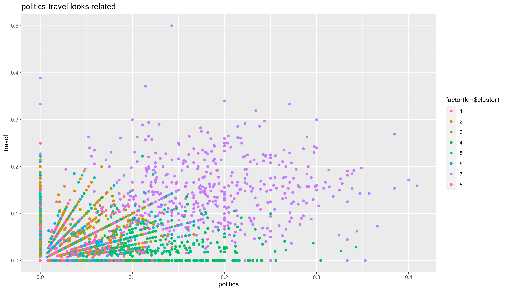
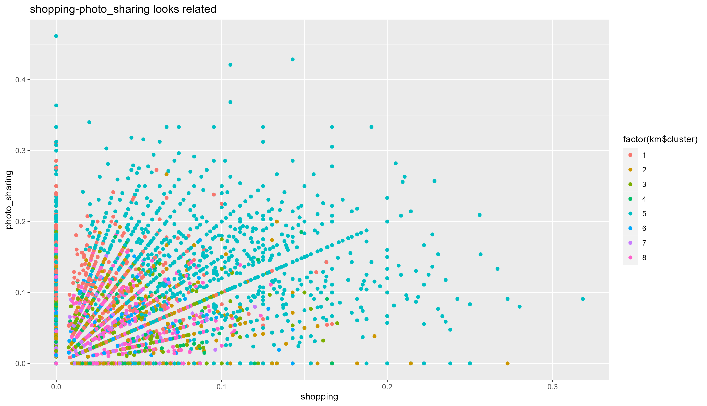
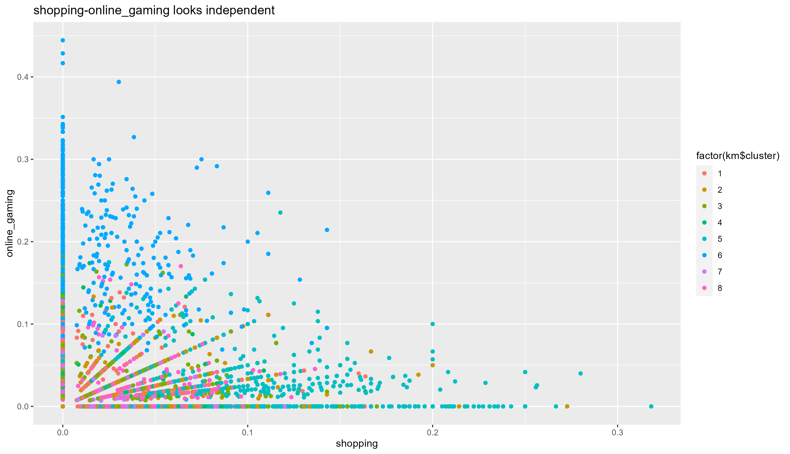
```

At the first top left picture, we can see tweets on beauty and politics does not relate to each others. But at the second top right picture, we can see tweets on travel and politics had positive relationship. Also, at the third bottom left picture, tweets on shopping and photo sharing had some positive relationship as well. However, at the fourth bottom right picture, it seems us that tweets on shopping and online gaming does not relate to each others.

These results are consistent with eight groups that we identified from the method of the correlation and PCA.

### 2-5-2: Linear probability model

The linear probability model we used in this analysis is as follow: 
$$
uncategorized\ tweets = \beta_0+ \beta[PC1-PC8]+\varepsilon
$$
The reason that we used the linear probability model is that that does not lose the information on the number of uncategorized tweets.(if the logit model, we have to create new dummy, uncategorized tweet or not. But in this case, we will lose the information on the number of uncategorized tweets.)

Also the detailed of the result is as follow:

```
lm(formula = uncategorized ~ PC1 + PC2 + PC3 + PC4 + PC5 + PC6 + 
    PC7 + PC8, data = Z)

Residuals:
     Min       1Q   Median       3Q      Max 
-0.04847 -0.02169 -0.00761  0.01287  0.35466 

Coefficients:
              Estimate Std. Error t value Pr(>|t|)    
(Intercept)  0.0230120  0.0003590  64.107  < 2e-16 ***
PC1          0.0015361  0.0002112   7.273 3.87e-13 ***
PC2         -0.0008606  0.0002213  -3.890 0.000101 ***
PC3          0.0005582  0.0002319   2.407 0.016112 *  
PC4          0.0004989  0.0002452   2.035 0.041920 *  
PC5          0.0003274  0.0002535   1.291 0.196586    
PC6          0.0027759  0.0002843   9.765  < 2e-16 ***
PC7         -0.0006407  0.0002977  -2.152 0.031408 *  
PC8         -0.0007794  0.0003288  -2.371 0.017788 *  
---
Signif. codes:  0 ‘***’ 0.001 ‘**’ 0.01 ‘*’ 0.05 ‘.’ 0.1 ‘ ’ 1

Residual standard error: 0.03068 on 7297 degrees of freedom
Multiple R-squared:  0.02476,	Adjusted R-squared:  0.02369 
F-statistic: 23.16 on 8 and 7297 DF,  p-value: < 2.2e-16
```

\newpage

# Association rules for grocery purchases

## 3-1 Overview, Data and Model

- Data:[groceries.txt](groceries.txt) <br>
- At first, we did Data cleaning for aplying for apriori function in the package of the "arules". That includes each people's id and data of something they bought. <br>
- Next, we crated grphml data from the apriori function with support = 0.005, condience=0.1, maxlen = 4, and lift >2. Regarding selecting these parameters, we are careful of what some data had bot high confidence and high supports because they are considered a strong rule.<br>
- Finally, we used Gephi to make a grpah from graphml data


## 3-2 Results and Conlcusion

```{r, echo=FALSE, message=FALSE, warning=FALSE, results='hide',eval=FALSE}
groceries = read.csv("groceries.txt", header=FALSE)

## Data cleaning
# Data-> ID + Word
id=1
data = data.frame()
for (row in 1:nrow(groceries)){
  for (column in 1: ncol(groceries)){
    if(groceries[row,column]!=""){
      if(nrow(data)==0){
        data=as.data.frame(cbind(id,groceries[row,column]))
      }else{
        data=as.data.frame(rbind(data,cbind(id,groceries[row,column]))) 
      }
    }
  }
  id=id+1
}

# Turn id into a factor
data$id = factor(data$id)

# First split data into a list of artists for each user
grceries_split = split(x=data$V2, f=data$id)

## Remove duplicates ("de-dupe")
groceries_d = lapply(grceries_split, unique)

## Cast this variable as a special arules "transactions" class.
groc = as(groceries_d, "transactions")

## Cast this variable as a special arules "transactions" class.
rules = apriori(groc, 
	parameter=list(support=.001, confidence=.01, maxlen=4))

png("./fig/3plot.png")
plot(rules, method='two-key plot')
dev.off()

groc_graph = associations2igraph(subset(rules, lift>2), associationsAsNodes = FALSE)
igraph::write_graph(groc_graph, file='groc_graph.graphml', format = "graphml")
```

```{r, echo=FALSE,out.width ="50%", out.height = "50%",fig.align='center'}
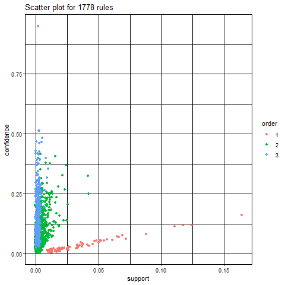
```

```{r, echo=FALSE,out.width ="80%", out.height = "80%",fig.align='center'}
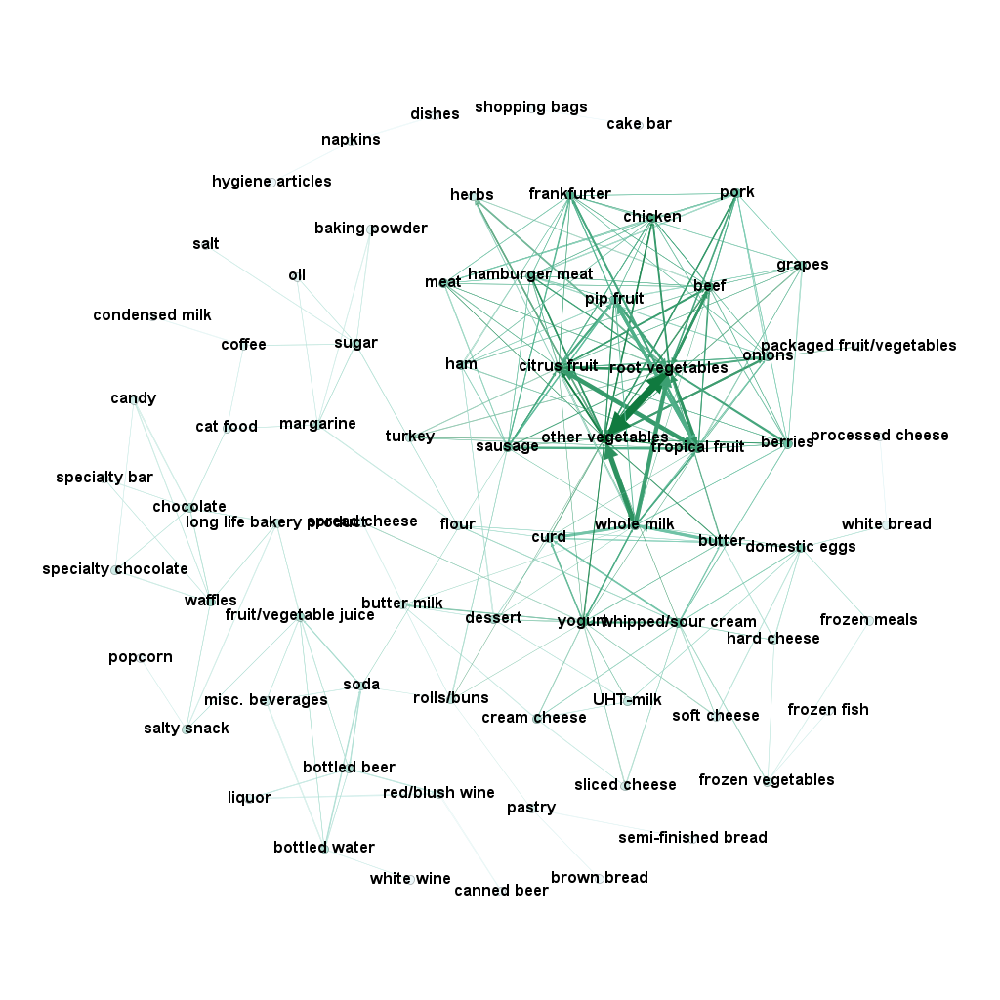
```

The former plot is the support-confidence plot.
The latter plot is the graphml plot.

For the former plot, as we mentioned before, we can see that some data has high supports and high confidence.

For the latter plot, we can find somethings as follow:

* Overall, the connection between vegetables, meats and fruits are strong. This means all of these products are bought by consumers daily.

* root vegetables and other vegetables are strong connection. So few consumer will buy root vegetables. <br>

* consumers who bought whole milk bought dairy products like yougrt, curd and butter. Probably because these products are located in near place and so consumers tends to buy other dairy products on that way. <br>

* frankfurter and tropical fruit's connection is a little bit of strong probably because consumers want them to do BBQ.


